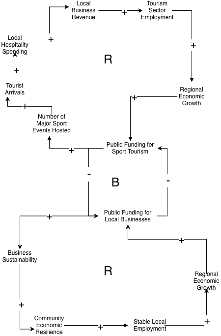

# Games or Growth: Public Investment Tradeoffs in Alberta’s Sport Tourism Economy

# Decision Maker: 
Alberta Minister of Tourism and Sport

# Decision: 
Should the Government of Alberta prioritize public investment in major sport tourism events and facilities, or direct those funds toward supporting local small business development in the hospitality sector?

> [!TIP]
> This could be difficult to answer because you are basing it on a counterfactural - it's one or the other but you probably don't have historical evidence of the outomes of both choices..  Find a way to compare the economic investment impact of both sides - so does 1M invested in tourism events lead to NNN GDP, how does that compare to hospitality

> [!WARNING] I see economic spinoff effect reports but no "open data".  This might be really hard to answer.  https://rto7.ca/Documents/Public/Festivals-Events/Economic-Impacts-of-97-Festivals-and-Events
> Consider a pivot to something like "Where are most people visiting in canada?" to reveal where investment dollars could be used stimulate.  Stats canada should have this data.

# Executive Summary
Sport tourism has become an increasingly prominent component of Alberta’s economic development strategy, with major sporting events, competitions, and sport infrastructure investments positioned as tools for attracting visitors, stimulating local spending, and supporting employment in the hospitality and tourism sectors. High-profile events such as national championships and international tournaments generate short-term economic activity through increased hotel occupancy, restaurant revenue, transportation demand, and retail spending. At the same time, Alberta’s local hospitality and tourism businesses continue to face structural challenges related to seasonality, workforce shortages, and uneven recovery across regions and communities. This creates a critical policy question regarding how limited public funds should be allocated to maximize long-term economic value.

The central decision facing Alberta’s economic and tourism policymakers is whether to prioritize public investment in attracting and hosting major sport tourism events and facilities, or to direct those resources toward sustained support for locally owned hospitality and tourism businesses. While sport tourism can produce concentrated economic boosts and international visibility, its benefits may be unevenly distributed and time-limited. In contrast, direct local business investment may strengthen long-term economic resilience but lack the visibility and immediate impact associated with large-scale events. This decision matters because it shapes employment patterns, business sustainability, community development, and the overall structure of Alberta’s tourism economy, influencing whether growth is driven by episodic event-based surges or by stable, locally anchored enterprise development.

[Read more](background.md)

## Initial CLD Diagram

### Key Feedback Loop Explanation

**R1 – Sport Tourism Growth Loop**
Increased public funding for sport tourism enables the hosting of more major sporting events, which attracts higher volumes of visitors to Alberta. These visitors generate increased hospitality spending, leading to higher local business revenues and growth in tourism sector employment. As employment and economic activity rise, regional economic growth strengthens, expanding public funding capacity and political support for continued sport tourism investment. This reinforcing loop creates a self-amplifying cycle where initial investments in sport tourism can compound economic returns over time.

**R2 – Local Economy Stability Loop**
Public investment in local business development improves business sustainability and strengthens community economic resilience. This resilience supports more stable local employment and contributes to long-term regional economic growth. As the economy becomes more stable and diversified, public funding capacity increases, enabling continued investment in local enterprises. This loop reinforces long-term economic stability by prioritizing sustained, community-anchored growth rather than episodic event-driven surges.

**B1 – Budget Constraint Loop**
Public funding for sport tourism and public funding for local business development compete for the same limited financial resources. As funding allocations increase in one area, fewer resources remain available for the other, creating a balancing dynamic. This budget constraint limits the expansion of both strategies simultaneously and forces policymakers to manage tradeoffs between short-term event-driven economic stimulation and long-term local business sustainability.
