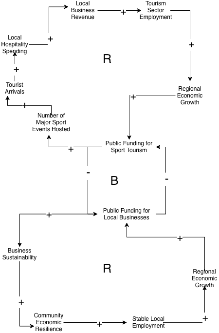

# The "Blue Paint" Dilemma

# Decision Maker: 
NHL General Managers

# Decision: 
Should an NHL General Manager commit a high-value, long-term contract to a single "Elite Starter" or allocate that same budget to a "1A/1B Tandem" for the 2025-26 season?

# Executive Summary

The National Hockey League operates under a rigorous hard salary cap, transforming roster construction into a high-stakes exercise in resource optimization. Historically, the prevailing wisdom favored the "workhorse" model, where a single elite goaltender commanded a significant percentage of the team’s budget and handled the vast majority of starts. However, the 2024-25 season underscored a shifting paradigm toward the "1A/1B" tandem model. As the speed and physical toll of the modern game increase, the decision of how to distribute capital within the "blue paint" has emerged as a primary determinant of a franchise’s long-term competitive ceiling.

This analysis focuses on the pivotal choice facing a General Manager during the Summer 2025 Free Agency period: committing a premium contract of $7.0 million or more to a single elite starter or allocating that same budget to pair two capable tandem goaltenders. This is not a simple talent evaluation but a complex risk-management problem. While elite stars offer a high degree of reliability and "star power," data from the most recent season suggests that lower-cost tandem players can often produce comparable efficiency on a per-dollar basis. Choosing the tandem route potentially allows a GM to reallocate millions in "cap savings" to bolster the defensive corps or top-six scoring depth, creating a more balanced and resilient roster.

The stakes of this decision are illustrated by the inherent volatility of the goaltending position. A single injury or a statistical regression from a high-priced starter can effectively close a championship window and leave a team with "dead cap" space that is difficult to move. Conversely, an improperly constructed tandem may lack the high-end capability required to steal a series during the Stanley Cup Playoffs. By evaluating the relationship between salary and advanced metrics like Goals Saved Above Expected (GSAx), this project establishes a decision-intelligence framework to help a General Manager minimize financial risk while maximizing the probability of post-season success.

[Read more](background.md)

## Initial CLD Diagram

### Key Feedback Loop Explanation

**R1 – Sport Tourism Growth Loop**
Increased public funding for sport tourism enables the hosting of more major sporting events, which attracts higher volumes of visitors to Alberta. These visitors generate increased hospitality spending, leading to higher local business revenues and growth in tourism sector employment. As employment and economic activity rise, regional economic growth strengthens, expanding public funding capacity and political support for continued sport tourism investment. This reinforcing loop creates a self-amplifying cycle where initial investments in sport tourism can compound economic returns over time.

**R2 – Local Economy Stability Loop**
Public investment in local business development improves business sustainability and strengthens community economic resilience. This resilience supports more stable local employment and contributes to long-term regional economic growth. As the economy becomes more stable and diversified, public funding capacity increases, enabling continued investment in local enterprises. This loop reinforces long-term economic stability by prioritizing sustained, community-anchored growth rather than episodic event-driven surges.

**B1 – Budget Constraint Loop**
Public funding for sport tourism and public funding for local business development compete for the same limited financial resources. As funding allocations increase in one area, fewer resources remain available for the other, creating a balancing dynamic. This budget constraint limits the expansion of both strategies simultaneously and forces policymakers to manage tradeoffs between short-term event-driven economic stimulation and long-term local business sustainability.

